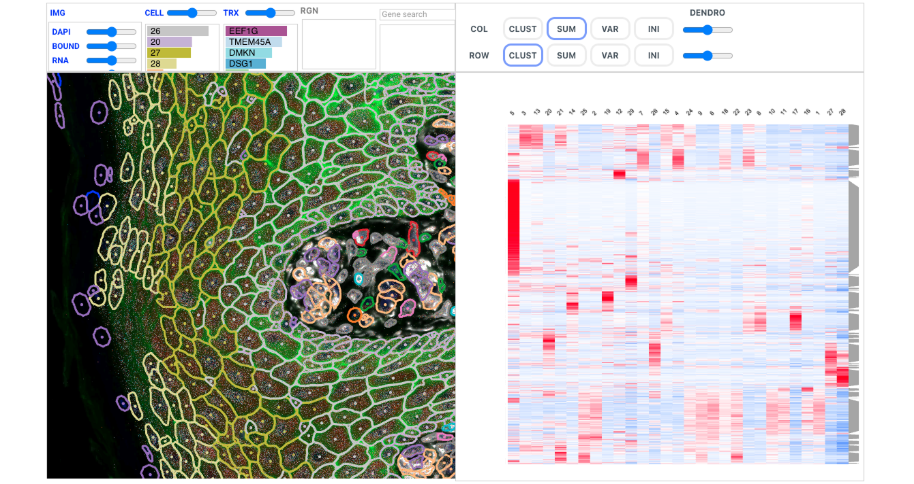

[](https://badge.fury.io/py/celldega)
[](https://www.python.org/downloads/)
[](LICENSE)
[](https://broadinstitute.github.io/celldega/)

> **Interactive spatial‑omics analysis & visualisation toolkit for single‑cell and spatial transcriptomics data**

**Celldega** combines scalable computational pipelines with GPU‑accelerated, web‑native visualisations so you can explore **millions of cells and transcripts** directly inside Jupyter Lab, VS Code, or any modern browser. Built for researchers working with Xenium, Visium HD, MERFISH, and other spatial omics technologies.

## 🚀 Quick Start (30 min)

### Installation

```bash
pip install celldega
```

### For Terra.bio Users

Add this to your startup script for image processing features ([more info](https://support.terra.bio/hc/en-us/articles/360058193872-Preconfigure-a-Cloud-Environment-with-a-startup-script)):

```bash
apt update && apt install -y libvips libvips-tools libvips-dev
```

### Example Usage

```python
base_url = 'https://raw.githubusercontent.com/broadinstitute/celldega_Xenium_Prime_Human_Skin_FFPE_outs/main/Xenium_Prime_Human_Skin_FFPE_outs'

landscape_ist = dega.viz.Landscape(
    technology="Xenium",
    ini_zoom=-4.5,
    ini_x=6000,
    ini_y=8000,
    base_url=base_url,
    height=700,
    width=600,
)

# Alternatively pass an AnnData object to auto-populate cell metadata
# including "leiden" clusters, colors and UMAP coordinates.
landscape_from_adata = dega.viz.Landscape(
    base_url=base_url,
    AnnData=adata,
)

file_path = 'https://raw.githubusercontent.com/broadinstitute/celldega_Xenium_Prime_Human_Skin_FFPE_outs/main/Xenium_Prime_Human_Skin_FFPE_outs/df_sig.parquet'
df = pd.read_parquet(file_path)

network = dega.clust.hc(df)
mat = dega.viz.Matrix(network=network, width=500, height=500)

dega.viz.landscape_matrix(landscape_ist, mat)
```



## 📖 Documentation & Examples

- **[📚 Documentation](https://broadinstitute.github.io/celldega/)** - Complete guides and API reference
- **[🖼️ Gallery](https://broadinstitute.github.io/celldega/gallery/)** - Interactive visualization demos
- **[📓 Examples](https://github.com/broadinstitute/celldega/tree/refactor-v0/notebooks)** - Jupyter notebooks you can run locally
- **[🐍 Python API](https://broadinstitute.github.io/celldega/python/)** - Complete Python API
- **[🌐 JavaScript API](https://broadinstitute.github.io/celldega/javascript/api/)** - Complete JavaScript API

## 🛠️ Development Setup (for Contributors)

**Get started contributing in 2 minutes:**

```bash
git clone https://github.com/broadinstitute/celldega.git
cd celldega

bash ./scripts/setup.sh

source dega/bin/activate
npm run dev
```

See our [Contributing Guide](CONTRIBUTING.md) for detailed instructions.

## 🏗️ Repository Structure

| Directory/File  | Purpose                                |
| --------------- | -------------------------------------- |
| `src/celldega/` | 🐍 Core Python package                 |
| `js/`           | 🌐 JavaScript widgets & visualizations |
| `examples/`     | 📓 Jupyter notebook examples           |
| `docs/`         | 📚 Documentation source                |
| `js/__tests__/` | 🧪 JS/TS Test suites                   |
| `tests/`        | 🧪 Python Test suites                  |
| `scripts/`      | 🔧 Development utilities               |

## 🤝 Contributing

We welcome contributions from the bio community! Whether you're a:

- 🧬 **Researcher** - Share datasets, create tutorials, improve documentation
- 👩‍💻 **Developer** - Add features, fix bugs, optimize performance
- 📚 **Educator** - Create educational content, examples, workshops
- 🎨 **Designer** - Improve visualizations, user experience, documentation

**Getting started:**

1. Read our [Contributing Guide](CONTRIBUTING.md)
2. Check [open issues](https://github.com/broadinstitute/celldega/issues) for ideas
3. Join [discussions](https://github.com/broadinstitute/celldega/discussions) to ask questions

## 🆘 Getting Help

**Questions about using Celldega?**

- 💬 [Discussions](https://github.com/broadinstitute/celldega/discussions) - Ask the community
- 📖 [Documentation](https://broadinstitute.github.io/celldega/) - Comprehensive guides
- 📓 [Examples](examples/) - Working code you can adapt

**Found a bug or want a feature?**

- 🐛 [Report bugs](https://github.com/broadinstitute/celldega/issues/new?template=bug_report.md)
- ✨ [Request features](https://github.com/broadinstitute/celldega/issues/new?template=feature_request.md)

## 📊 Citation

If Celldega helps your research, please cite us:

```bibtex
@software{celldega,
  title   = {Celldega: Interactive spatial‑omics analysis & visualisation toolkit},
  author  = {{Broad Institute}},
  url     = {https://github.com/broadinstitute/celldega},
  version = {0.12.0},
  year    = {2025}
}
```

## 🏛️ About

**Celldega** is developed at the [Broad Institute](https://broadinstitute.org/) together with the biology research community. Our mission is to make spatial transcriptomics analysis accessible, interactive, and beautiful.

Built on amazing open source tools:

- **[deck.gl](https://deck.gl/)** - GPU-accelerated visualizations
- **[PyArrow](https://arrow.apache.org/docs/python/)** - Fast columnar data processing
- **[AnnData](https://anndata.readthedocs.io/)** - Annotated data matrices
- **[SpatialData](https://spatialdata.scverse.org/)** - Spatial omics data structures

---

<div align="center" style="padding: 20px;">

Made with 🧬 by the [Spatial Technology Platform](https://www.broadinstitute.org/spatial-technology-platform) at the [Broad Institute](https://broadinstitute.org/)

</div>
