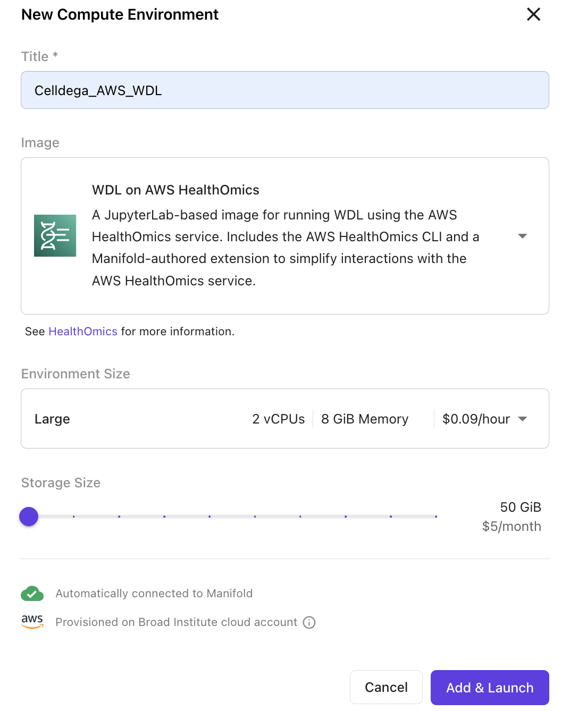
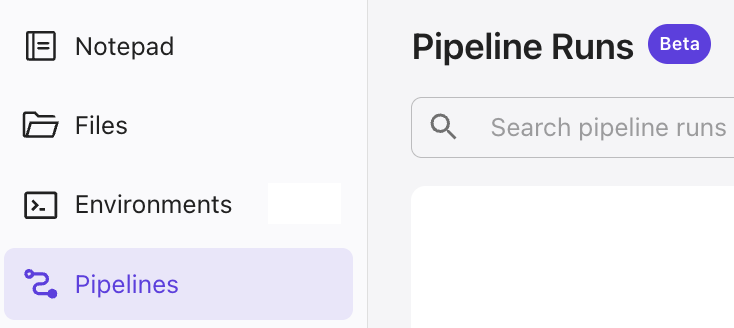

# Tutorial: Generating Celldega LandscapeFiles on Manifold

This guide explains how to submit workflows for generating **Celldega LandscapeFiles** on **Manifold**, using a Jupyter Notebook environment.

---

## 1. Overview

The `run_landscape_wdl.sh` script automates launching the **LandscapeFiles WDL workflow** via **AWS HealthOmics**.
It performs the following steps:

1. Validates inputs
2. Clones the [official workflow repository](https://github.com/broadinstitute/stp_celldega_landscape_files)
3. Submits the WDL pipeline to AWS HealthOmics using a user-provided `.json` input file

The input file (e.g., `celldega_inputs.json`) defines workflow parameters such as dataset location, output bucket, and the technology.

---

## 2. Environment and File Setup

### AWS HealthOmics Environment

Create an environment using the **“WDL on AWS HealthOmics”** base image.
This image includes the dependencies required to submit WDL workflows to AWS HealthOmics directly.



---

### The Shell Script

`run_landscape_wdl.sh` handles workflow setup and execution automatically.
You can use relative or absolute paths to reference the script in your notebook.

> **Note:** The `run_landscape_wdl.sh` script is available on the [official workflow repository](https://github.com/broadinstitute/stp_celldega_landscape_files).
> Once deployed, you can reference it directly from your environment or the shared Manifold workbench.

---

### Example Input JSON

You can either create the input JSON manually or generate it programmatically.
Here’s a quick example (`celldega_inputs.json`):

```python
import json

inputs = {
    "LandscapeFiles.sample": "dataset-name",
    "LandscapeFiles.data_dir": "s3://project/data/",
    "LandscapeFiles.bucket_path_landscape_files": "s3://project/landscape_files/",
    "LandscapeFiles.technology": "technology-name",
    "LandscapeFiles.bin_size": 2,
    "LandscapeFiles.tile_size": 500,
    "LandscapeFiles.use_dummy_clusters": False
}

with open("celldega_inputs.json", "w") as f:
    json.dump(inputs, f, indent=2)
```

This file specifies:

* **Which sample** to process
* **Where to find** the instrument data
* **Where to save** the output LandscapeFiles
* **Which spatial technology** is used (e.g., **Xenium**, **Visium-HD**, **MERSCOPE**)

---

### Input Parameter Glossary

| Parameter                            | Type    | Description                                                                                                                           |
| ------------------------------------ | ------- | ------------------------------------------------------------------------------------------------------------------------------------- |
| `bucket_path_landscape_files`        | `str`   | AWS S3 path to the **output directory** where generated LandscapeFiles will be saved (e.g., `s3://my-output-bucket/landscapefiles/`). |
| `data_dir`                           | `str`   | AWS S3 path to the **input data directory** containing the files needed for processing (e.g., `s3://my-input-bucket/data/`).          |
| `sample`                             | `str`   | The **sample name** or identifier for the dataset being processed.                                                                    |
| `technology`                         | `str`   | The **spatial technology** used to generate the data (e.g., `"Visium-HD"`, `"MERSCOPE"`, `"Xenium"`).                        |
| `bin_size` *(optional)*              | `int`   | For sST technologies like Visium-HD: the **spatial binning size** (in microns). Default: `2`.                |
| `celldega_docker_image` *(optional)* | `str`   | The **Docker image URI** for running Celldega. Override this to use a specific image version. Default: latest maintained version.     |
| `image_file_path` *(optional)*       | `str`   | For sST technologies like Visium-HD: Path to an **associated image file** (e.g., histology image) for visualization.                                                       |
| `image_scale` *(optional)*           | `float` | Scaling factor applied to the input image when image and coordinate resolutions differ.                                               |
| `jitter` *(optional)*                | `int`   | For sST technologies like Visium-HD: Adds small **random spatial offsets** to prevent overplotting of bins.                                                    |
| `tile_size` *(optional)*             | `int`   | The **tile dimension (in pixels)** used to subdivide large data for processing.                                                       |
| `use_dummy_clusters`                 | `bool`  | Whether to use **dummy clusters** (a single cluster labeled `0`) instead of real clustering results.                                  |


---

## 3. Grant Execution Permissions

In your Jupyter notebook, make the script executable:

```bash
!chmod +x run_landscape_wdl.sh
```

---

## 4. View Script Usage (Optional)

To display the script’s usage instructions:

```bash
!./run_landscape_wdl.sh --help
```

Output:

```
Usage: ./run_landscape_wdl.sh --input <input_json>
Example: ./run_landscape_wdl.sh --input celldega_inputs.json
```

---

## 5. Submit Independent Workflow Runs

You can run one or multiple input files independently.
Each submission is self-contained and processes a separate dataset.

Example:

```bash
!./run_landscape_wdl.sh --input celldega_inputs_technology-1.json
!./run_landscape_wdl.sh --input celldega_inputs_technology-2.json
!./run_landscape_wdl.sh --input celldega_inputs_technology-3.json
```

---

## 6. Monitoring Workflows

Monitor workflow progress and job status under the **Pipelines** tab in Manifold.



---

## 7. Retrieve Results

After successful submission, workflow outputs are written to the S3 path defined in your JSON file:

```
s3://output-data-dir/
```

---

## 8. Troubleshooting

Each workflow run creates a dedicated folder under:
`s3://output-data-dir/workflow_logs/`

This makes it easier to debug or track submissions.

Common issues:

| Error                                                       | Cause                 | Solution                                                                         |
| ----------------------------------------------------------- | --------------------- | -------------------------------------------------------------------------------- |
| `omics: command not found`                                  | AWS Omics CLI missing | Ensure the environment uses the **WDL on AWS HealthOmics** image.                |
| `Could not read LandscapeFiles.bucket_path_landscape_files` | Missing JSON key      | Check that your input JSON includes this field.                                  |
| `Permission denied`                             | Credential issue  | Contact the Manifold and STP team.       |
