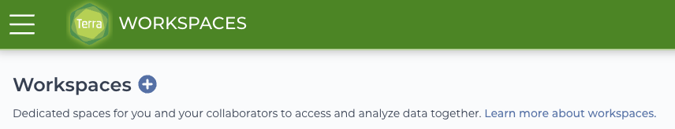
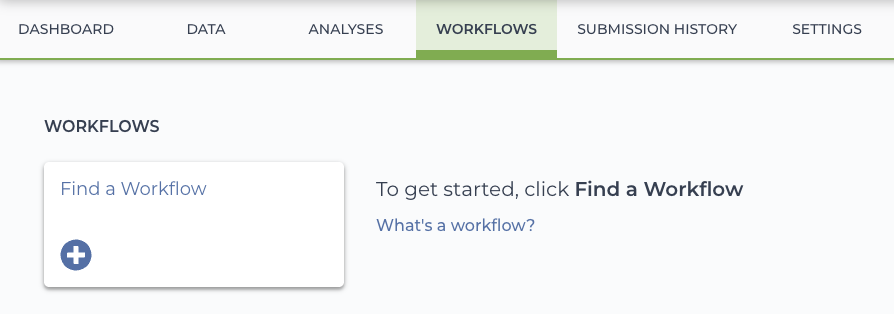
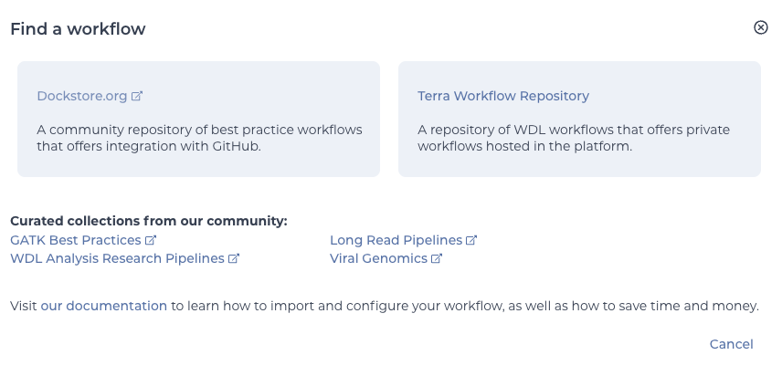
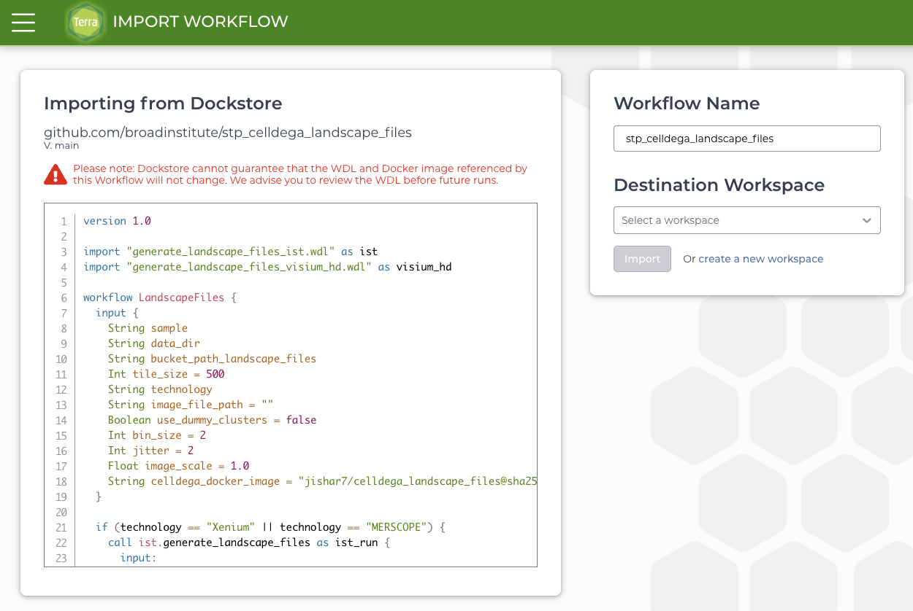
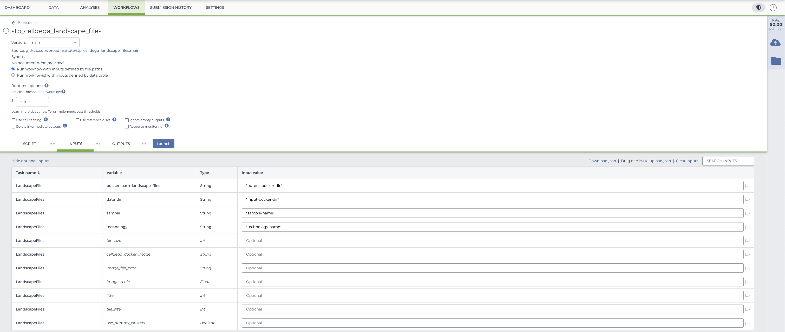
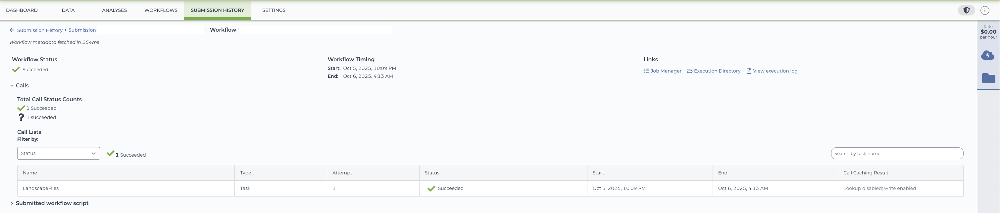

# Tutorial: Generating Celldega LandscapeFiles on Terra

This guide walks you through submitting and running workflows to generate **Celldega LandscapeFiles** using the **Terra** platform.

---

## 1. Overview

The **Celldega LandscapeFiles** workflow (`stp_celldega_landscape_files`) can be launched directly from Terra via **Dockstore**.
You’ll need a Terra workspace before proceeding.

---

## 2. Step-by-Step Instructions

### Step 1: Create or Select a Workspace

1. Log in to [Terra](https://app.terra.bio/).
2. Create a new workspace or open an existing one where you want to run the workflow.

---

### Step 2: Locate the Workflow

1. In your workspace, navigate to the **Workflows** tab.
   

2. Click **Find a Workflow**.

3. Select **Dockstore.org** as the source.
   

4. Search for **stp_celldega_landscape_files**.

5. Click **Launch with Terra** to import the workflow.

---

### Step 3: Import the Workflow

1. In the **Launch with Terra** dialog, select your workspace from the **Destination Workspace** dropdown menu.
2. Click **Import** to add the workflow to your workspace.
3. Once imported, open the workflow by clicking on its name.

---

### Step 4: Configure Inputs

1. Review the input fields listed for the workflow.
2. Provide all **required inputs** and any **optional parameters** relevant to your technology (e.g., **Visium**, **Xenium**, **MERSCOPE**).
3. *(Optional but recommended)* Set a **cost threshold** to limit compute expenses and prevent unintended overruns.

---

### Input Parameter Glossary

| Parameter                            | Type    | Description                                                                                                                           |
| ------------------------------------ | ------- | ------------------------------------------------------------------------------------------------------------------------------------- |
| `bucket_path_landscape_files`        | `str`   | The Google Cloud Storage path to the **output directory** where generated LandscapeFiles will be saved (e.g., `s3://my-output-bucket/landscapefiles/`). |
| `data_dir`                           | `str`   | The Google Cloud Storage path to the **input data directory** containing the files needed for processing (e.g., `s3://my-input-bucket/data/`).          |
| `sample`                             | `str`   | The **sample name** or identifier for the dataset being processed.                                                                    |
| `technology`                         | `str`   | The **spatial technology** used to generate the data (e.g., `"Visium-HD"`, `"MERSCOPE"`, `"Xenium"`).                        |
| `bin_size` *(optional)*              | `int`   | For sST technologies like Visium-HD: the **spatial binning size** (in microns). Default: `2`.                |
| `celldega_docker_image` *(optional)* | `str`   | The **Docker image URI** for running Celldega. Override this to use a specific image version. Default: latest maintained version.     |
| `image_file_path` *(optional)*       | `str`   | For sST technologies like Visium-HD: Path to an **associated image file** (e.g., histology image) for visualization.                                                       |
| `image_scale` *(optional)*           | `float` | Scaling factor applied to the input image when image and coordinate resolutions differ.                                               |
| `jitter` *(optional)*                | `int`   | For sST technologies like Visium-HD: Adds small **random spatial offsets** to prevent overplotting of bins.                                                    |
| `tile_size` *(optional)*             | `int`   | The **tile dimension (in pixels)** used to subdivide large data for processing.                                                       |
| `use_dummy_clusters`                 | `bool`  | Whether to use **dummy clusters** (a single cluster labeled `0`) instead of real clustering results.                                  |

---

### Step 5: Launch the Workflow

1. After saving your input configuration, click **Launch** to start the workflow.
2. The workflow will begin executing on Terra. You can continue to monitor progress as it runs.

---

### Step 6: Monitor the Workflow

1. Open the **Submission History** tab to monitor workflow progress.
2. You can view logs, task statuses, and cost information in real time.
3. Once the run is complete, the generated **Celldega LandscapeFiles** will appear in the output directory you specified.

---

## 3. Outputs

Upon successful completion, the workflow will produce a set of **Celldega LandscapeFiles** in your specified output bucket.
These files can be used for downstream visualization, data exploration, etc.

---

## 4. Tips and Best Practices

* Verify that all input file paths are correct before launching a run.
* Use Terra’s built-in cost monitoring tools to stay within your compute budget.
* If a workflow fails, review the **Job Manager Logs** under the **Submission History** tab for detailed error messages.