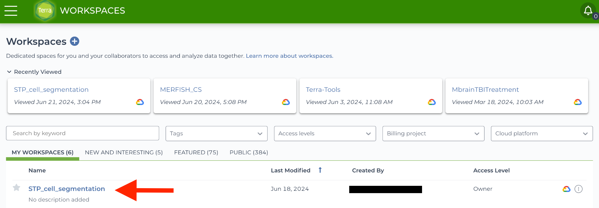
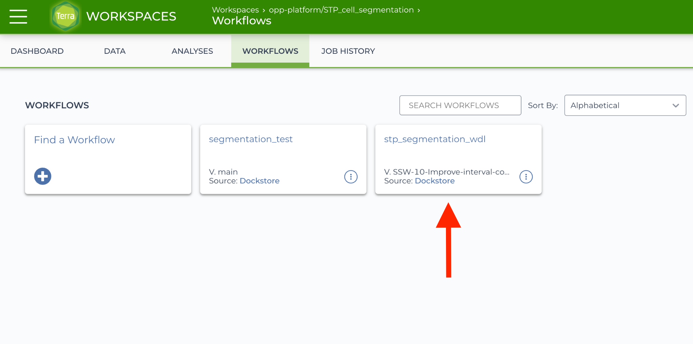
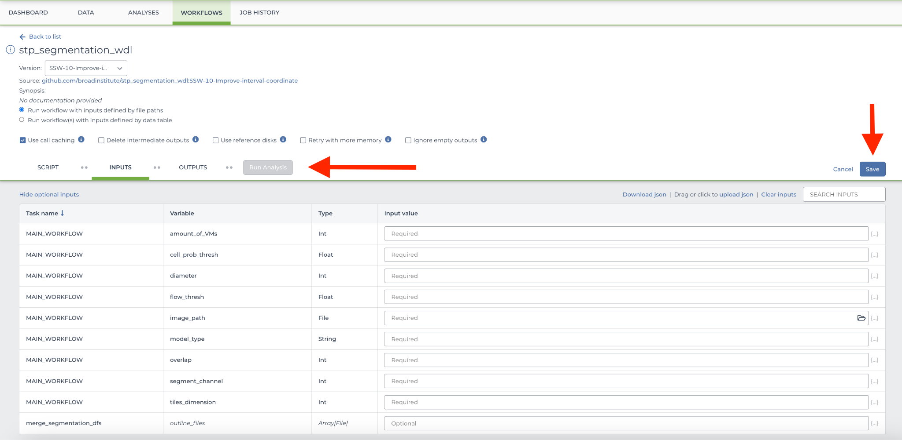
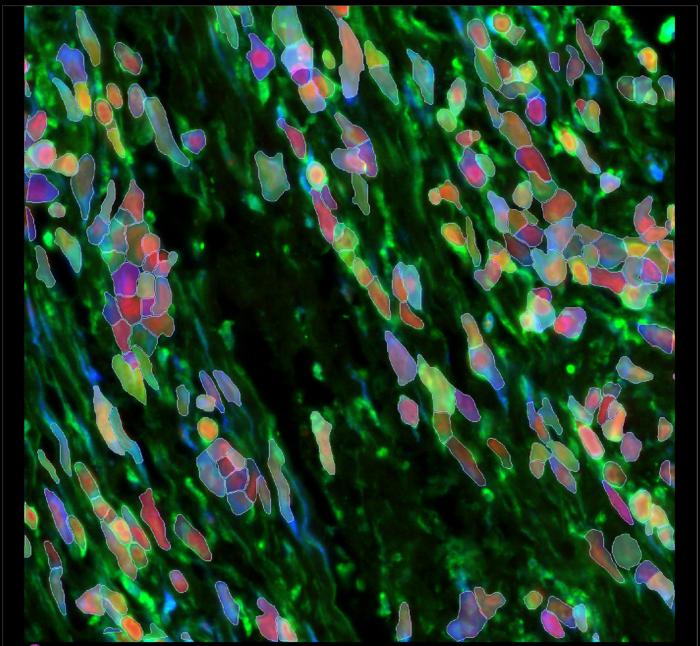
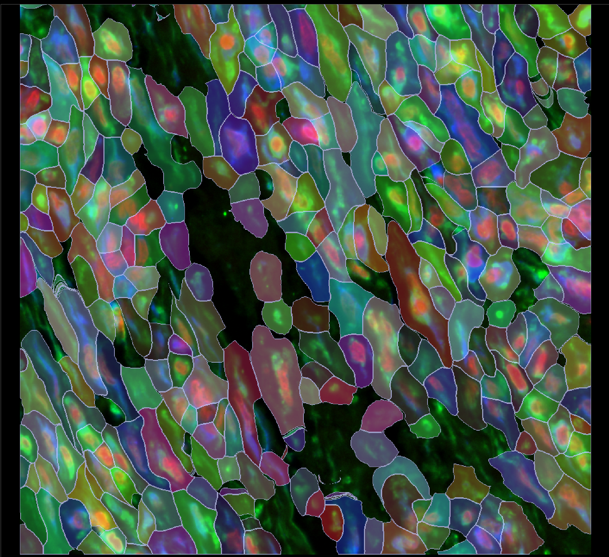

# STP Segmentation Usage on Terra.bio

The following guide assumes some familiarity with Terra, WDL, and the basics of running workflows in a cloud environment.

Click [here](https://support.terra.bio/hc/en-us/articles/360022714931-Overview-Research-in-the-cloud-on-Terra) for a brief overview of Terra, and [here](https://github.com/openwdl/wdl) for a brief overview of WDL.

### Overview

The [stp_segmentation_wdl GitHub repository](https://github.com/broadinstitute/stp_segmentation_wdl) contains WDL workflows for running cell segmentation tasks, utilizing Python scripts for preprocessing, segmentation, and postprocessing. These workflows are designed for compatibility with Cromwell, the WDL execution engine, and are ready to be deployed on Terra.

### Repository Contents

The repository includes:

* Main WDL Files: Defines the workflow, tasks, and their dependencies.

* Task WDL Files: Breaks workflows into specific steps, e.g., image preprocessing, running segmentation algorithms like Cellpose, Instanseg, etc., and result handling.

* Python Scripts: Found in the repository's source folder (or referenced in WDL tasks). These scripts handle computational tasks like tiling, segmentation, merging tiling results and assignment of transcripts.

* Docker Files: Predefined images (hosted on Docker Hub) to ensure reproducibility across environments.

### Terra Workspace Setup

- Access the GitHub Repository

Visit stp_segmentation_wdl GitHub repository and review the [README](https://github.com/broadinstitute/stp_segmentation_wdl/blob/main/README.md) for guides, specific details about prerequisites, and local workflow execution.

- Set Up a Terra Workspace

Log in to [Terra](https://terra.bio/). If a dedicated workspace does not already exist, create one by navigating to the `Workspaces` tab and clicking the plus (+) icon next to the Workspaces heading. More details can be found [here](https://support.terra.bio/hc/en-us/articles/19844636053019-Intro-to-your-Terra-workspace).

<div class="grid cards" markdown>

- Workspaces 

</div>

- Import the Workflow

In the workspace, go to the `Workflows` tab. Click `Find a Workflow`, search for `stp_segmentation_wdl`, and import the appropriate version. More details can be found [here](https://support.terra.bio/hc/en-us/articles/17799268537371-How-to-find-a-workflow).

<div class="grid cards" markdown>

- Workflows 

</div>

- Input Configuration

Use the intuitive Terra workflow submission GUI to provide relevant WDL inputs or create an inputs.json file based on your dataset. Key inputs include:

* Image Data: Cloud storage paths to the images (e.g., .tif).

* Transcript Data: Cloud storage paths to the transcript data files (e.g., .csv, .parquet).

* Segmentation Parameters: Adjust options like tile size, model type, or thresholds.

<div class="grid cards" markdown>

- Inputs 

</div>

Example JSON:

```
{
    "MAIN_WORKFLOW.algorithm": "CELLPOSE",
    "MAIN_WORKFLOW.amount_of_VMs": 5,
    "MAIN_WORKFLOW.detected_transcripts_file": "gs://---//transcripts.parquet",
    "MAIN_WORKFLOW.image_paths_list": "gs://---//image.tif",
    "MAIN_WORKFLOW.technology": "XENIUM",
    "MAIN_WORKFLOW.transcript_chunk_size": 100000,
    "MAIN_WORKFLOW.transform_file": "gs://---//transform.csv",
    "MAIN_WORKFLOW.cell_prob_thresh": -1.0,
    "MAIN_WORKFLOW.diameter": 0,
    "MAIN_WORKFLOW.flow_thresh": 0.8,
    "MAIN_WORKFLOW.image_pixel_size": 1,
    "MAIN_WORKFLOW.merge_approach": "larger",
    "MAIN_WORKFLOW.model_type": "",
    "MAIN_WORKFLOW.optional_channel": 1,
    "MAIN_WORKFLOW.overlap": 400.0,
    "MAIN_WORKFLOW.pretrained_model": "gs://---//custom_cp2_model",
    "MAIN_WORKFLOW.segment_channel": 2,
    "MAIN_WORKFLOW.sigma": 0,
    "MAIN_WORKFLOW.subset_data_y_x_interval": [1000,1500,1000,1500],
    "MAIN_WORKFLOW.tiles_dimension": 3000.0,
    "MAIN_WORKFLOW.transcript_plot_as_channel": 0,
    "MAIN_WORKFLOW.trim_amount": 100
}
```

- Running the Workflow

To execute the workflow, click `Run Analysis` after setting up inputs.

- Review Outputs

After execution, outputs such as segmented cell boundaries, tiled images, assigned transcripts as well as meta data will be available in the corresponding submission ID-specific directory within the workspace-associated Cloud Storage Bucket.

### Re-training a Custom Cellpose2 Model

To set up Cellpose, follow the instructions provided [here](https://cellpose.readthedocs.io/en/latest/).

To retrain a custom Cellpose 2 model, select a few tissue regions (e.g., four) where the default segmentation results are suboptimal or inaccurate.

<div class="grid cards" markdown>

- Region from the Xenium Human Skin Cancer Dataset: 246 polygons before manual curation 

</div>

These selected regions will serve as training data for the custom model. Additionally, choose a separate subset of images to use as a test set.

Next, extract the default segmentation masks and refine them using the Cellpose GUI or the Celldega GUI (beta). Then, train a custom model using the Cellpose GUI by following the instructions below.

* Upload a region of interest from your dataset into the Cellpose GUI.
* Upload the corresponding segmentation masks and manually curate them as needed.
* Repeat this process for different subsections of the same image to create a diverse training set.
* Train a custom model using the curated data. Use either the GUI or the terminal (command below) to retrain the custom model:

`python -m cellpose --train --dir {images_dir} --pretrained_model {base_model_name} --mask_filter _seg.npy --model_name_out {retrained_custom_model} --verbose`

Once training is complete, evaluate the model using the designated test set. You may retrain the model multiple times, incorporating additional training images or adjusting model parameters as needed to improve performance.

When the model achieves satisfactory results, upload it to the appropriate Google Bucket linked to your Terra workspace. Then, reference the model in the workflow variable pretrained_model using its full bucket path.

Success criteria may include:

* Clear qualitative improvement over default segmentation in at least one problematic tissue region
* Increased transcript assignment rate
* Higher total cell count
* Greater average cell area

<div class="grid cards" markdown>

- Region from the Xenium Human Skin Cancer Dataset: 312 predicted polygons by a custom Cellpose2 model after manual curation 

</div>

### Custom Segmentation Visualization in Celldega

Explore a custom segmentation run on Celldega [here](../../examples/brief_notebooks/Custom_Segmentation.ipynb).