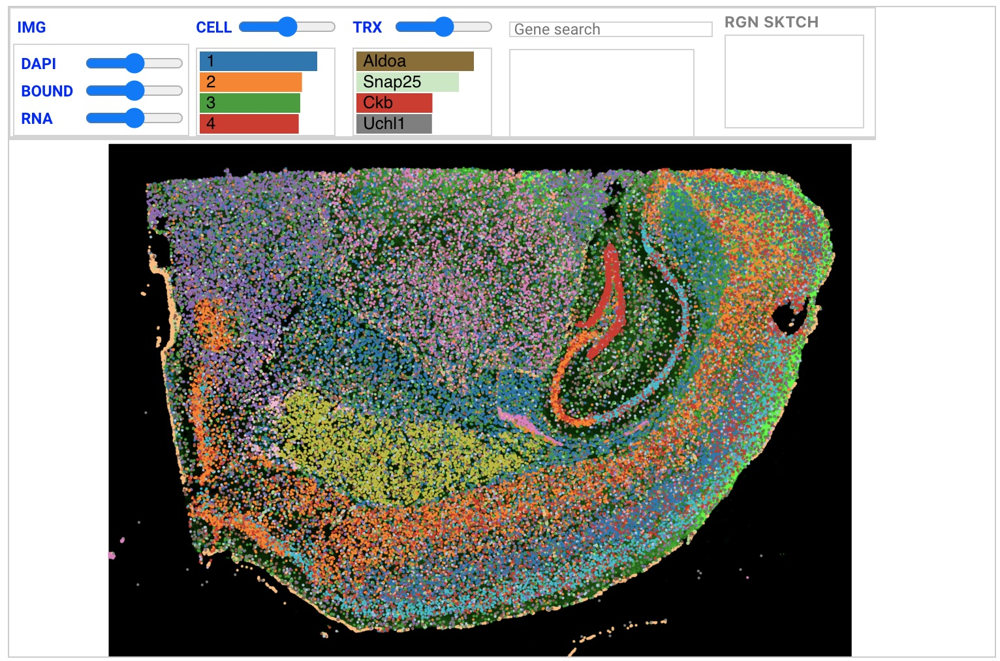
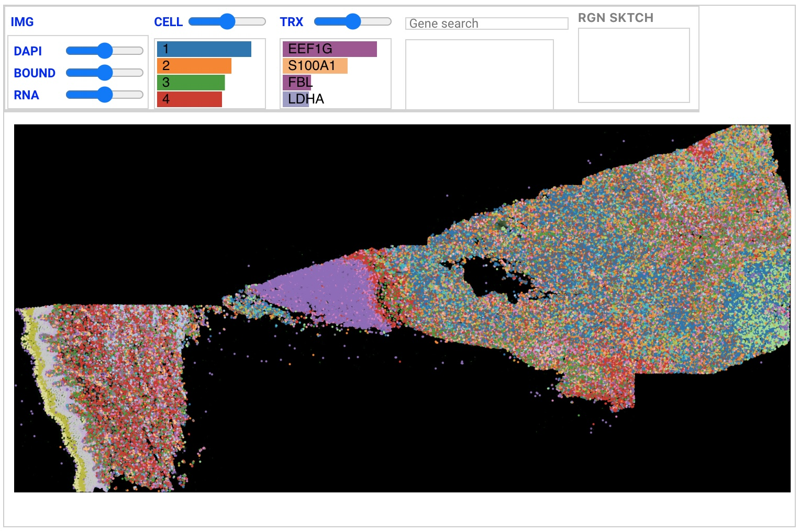
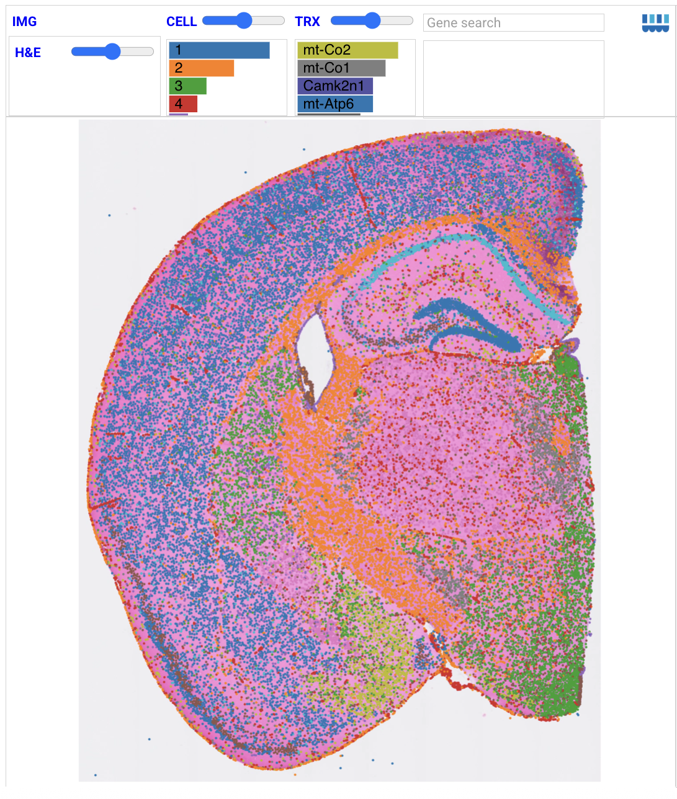
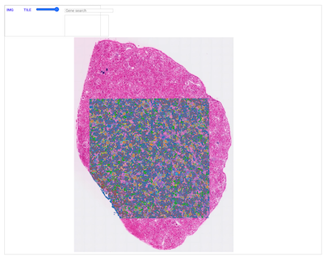
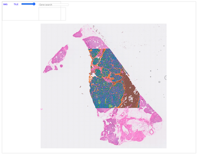

# Celldega Gallery

This page includes links to visualizations made with the stand-alone [Celldega JavaScript library](../javascript/index.md).

## Linked Views

Interactive examples showing linked visualizations where clicking in one view updates others.

- [Landscape-Clustergram](gallery_landscape_clustergram.md) - Link a spatial Landscape with a Clustergram heatmap
- [Landscape-Yearbook](gallery_landscape_yearbook.md) - Link a spatial Landscape with a Yearbook cell gallery

## Imaging Spatial Transcriptomics

### Xenium

- [Xenium Mouse Brain ](gallery_xenium_mouse_brain.md)
- [Xenium Human Skin Cancer ](gallery_xenium_skin_cancer.md)

## Sequencing Spatial Transcriptomics

### Visium HD

- [Visium HD Cell Segmentation Mouse Brain ](gallery_visium_hd_cell_segmentation_mouse_brain.md)
- [Visium HD Human Kidney ](gallery_visium_hd_human_kidney.md)
- [Visium HD Human Pancreas ](gallery_visium_hd_pancreas.md)

