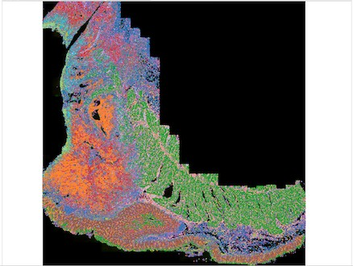

# Celldega Gallery

This page includes links to visualizations made with the stand-alone [Celldega JavaScript library](../javascript/index.md).

## Imaging Spatial Transcriptomics

### Xenium

- [Xenium Mouse Brain ](gallery_xenium_mouse_brain.md)
- [Xenium Human Skin Cancer ](gallery_xenium_skin_cancer.md)

### Atera

- [Atera Xenium Breast Cancer](gallery_atera.md)

### CosMx

- [CosMx Human Colon CRC (WTx) ](gallery_cosmx_human_colon.md)

## Sequencing Spatial Transcriptomics

### Visium HD

- [Visium HD Cell Segmentation Mouse Brain { width="300" }](gallery_visium_hd_cell_segmentation_mouse_brain.md)

