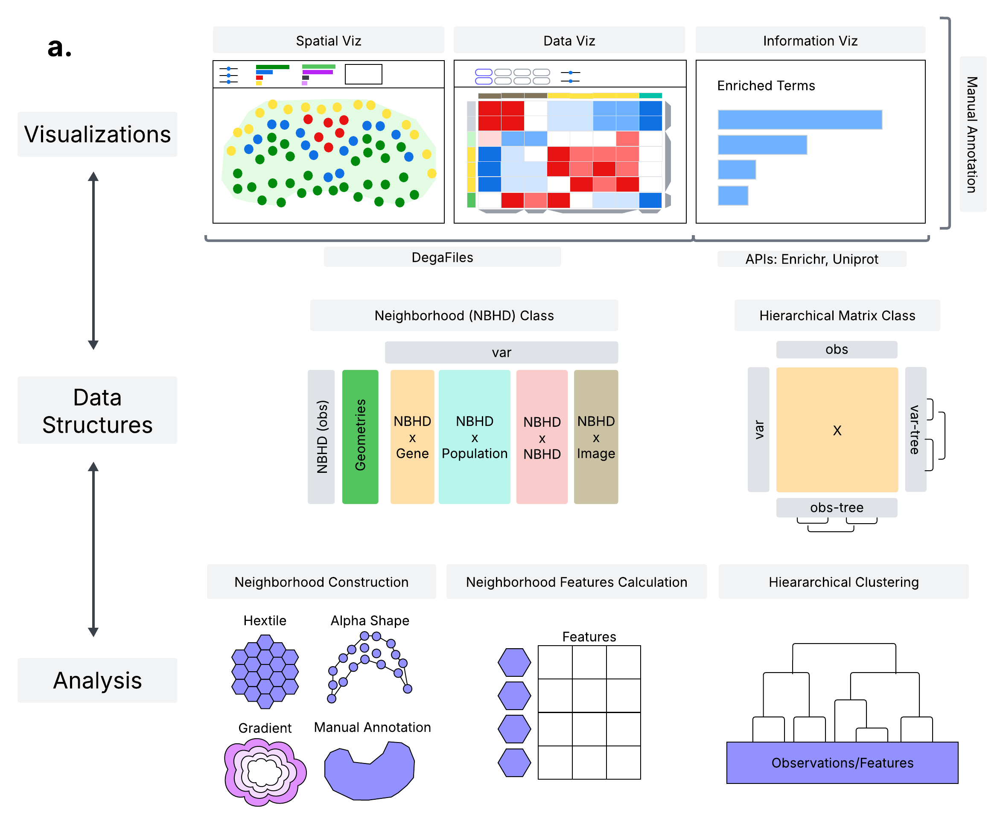

# Overview

Celldega is a spatial analysis and visualization library developed by the [Spatial Technology Platform](https://www.broadinstitute.org/spatial-technology-platform) at the [Broad Institute of MIT and Harvard](https://www.broadinstitute.org). It enables researchers to easily visualize and analyze large spatial transcriptomics (ST) datasets alongside single-cell and spatial analysis notebook workflows.



## Key Features

- **Large Dataset Support**: Efficiently visualize datasets with >100M transcripts
- **Interactive Widgets**: Jupyter Widget-based visualizations that integrate with notebook workflows
- **Multi-platform Support**: Works with Xenium, MERSCOPE, Visium HD, and Chromium data
- **Linked Visualizations**: Connect Landscape views with Clustergram heatmaps
- **Neighborhood Analysis**: Define and analyze tissue neighborhoods with alpha shapes and hextiles

## Key Concepts

### DegaFiles

DegaFiles is the file format used by Celldega to store pre-processed data for fast web-based visualization. These files include:

- Image pyramids (for efficient zooming)
- Cell metadata and boundaries
- Transcript locations
- Gene expression data
- Cluster assignments

### Widgets

Celldega provides several Jupyter Widget classes for interactive visualization:

| Widget | Description |
|--------|-------------|
| `Landscape` | Main spatial visualization for IST/SST data |
| `Clustergram` | Hierarchical clustering heatmap (matrix) |
| `Yearbook` | Grid of cell portraits |
| `Enrich` | Gene enrichment analysis widget |

### Supported Technologies

Celldega supports multiple spatial transcriptomics platforms:

- **Xenium** (10x Genomics)
- **MERSCOPE** (Vizgen)
- **Visium HD** (10x Genomics)
- **Chromium** (single-cell RNA-seq)
- **Custom point-cloud data**

## Architecture

Celldega consists of two main components:

### Python Library

Used in Jupyter notebooks for:

- Pre-processing raw ST data into DegaFiles format
- Clustering and analysis with the Matrix class
- Neighborhood computation with alpha shapes and hextiles
- Creating interactive visualization widgets

### JavaScript Library

Powers the interactive visualizations:

- Deck.gl-based spatial rendering
- Efficient tile-based data loading
- Synchronized multi-view displays
- Web-compatible standalone usage

## Workflow

A typical Celldega workflow involves:

1. **Pre-process** raw data to create DegaFiles
2. **Cluster** and analyze data using Scanpy/Squidpy
3. **Visualize** with interactive widgets
4. **Explore** spatial patterns and gene expression

```python
import celldega as dega
import scanpy as sc

# Pre-process data
dega.pre.main(technology="Xenium", data_dir="./data", path_landscape_files="./output")

# Load and cluster
adata = sc.read_h5ad("processed.h5ad")
sc.tl.leiden(adata)

# Visualize
landscape = dega.viz.Landscape(base_url="./output", adata=adata, ini_zoom=-5)
landscape
```


## Quick Start

### 1. Install Celldega

```bash
pip install celldega
```

### 2. Visualize Pre-processed Data

If you have pre-processed DegaFiles:

```python
import celldega as dega

# Create a Landscape widget
landscape = dega.viz.Landscape(
    base_url="https://your-landscape-files-url",
    ini_x=10000,
    ini_y=10000,
    ini_zoom=-5,
    height=600
)
landscape
```

### 3. Pre-process Your Own Data

For Xenium data:

```python
import celldega as dega

# Pre-process Xenium data to create DegaFiles
dega.pre.main(
    technology="Xenium",
    data_dir="/path/to/xenium_outs",
    path_landscape_files="/path/to/output",
    tile_size=250
)
```

### 4. Integrate with AnnData

Celldega integrates seamlessly with AnnData objects from Scanpy:

```python
import scanpy as sc
import celldega as dega

# Load and process your data
adata = sc.read_h5ad("your_data.h5ad")
sc.tl.leiden(adata)
sc.tl.umap(adata)

# Visualize with Celldega
landscape = dega.viz.Landscape(
    base_url="https://your-landscape-files-url",
    adata=adata,
    ini_x=10000,
    ini_y=10000,
    ini_zoom=-5
)
landscape
```

### 5. Create a Clustergram

```python
import celldega as dega

# Create a Matrix from AnnData
mat = dega.clust.Matrix(adata)
mat.cluster()

# Visualize as a Clustergram
cgm = dega.viz.Clustergram(matrix=mat, width=800, height=600)
cgm
```

## Try It Online

### Google Colab

Try Celldega in Google Colab without any installation:

- [Celldega Xenium Landscape Visualizations](https://colab.research.google.com/drive/1NVZ07R0Eb-Xz6KBmMGRe3qmksYdeSBWc?usp=sharing)
- [Domain Identification Algorithms Comparison in Celldega](https://colab.research.google.com/drive/15rBZazHeoF8JGJuRy703FK5RO6PWGd1z?usp=sharing)

### ObservableHQ

Explore Celldega as a standalone JavaScript library:

- [Celldega Landscape Xenium ObservableHQ](https://observablehq.com/@cornhundred/celldega-landscape-xenium-observablehq)

## Next Steps

- [Installation](installation.md) - Detailed installation instructions
- [Usage](usage.md) - In-depth usage guide
- [File Formats](file_formats/index.md) - DegaFiles format specification
- [Python API](python/index.md) - Full Python API reference
- [JavaScript API](javascript/index.md) - JavaScript API for web applications
- [Tutorials](tutorials/index.md) - Jupyter notebook tutorials