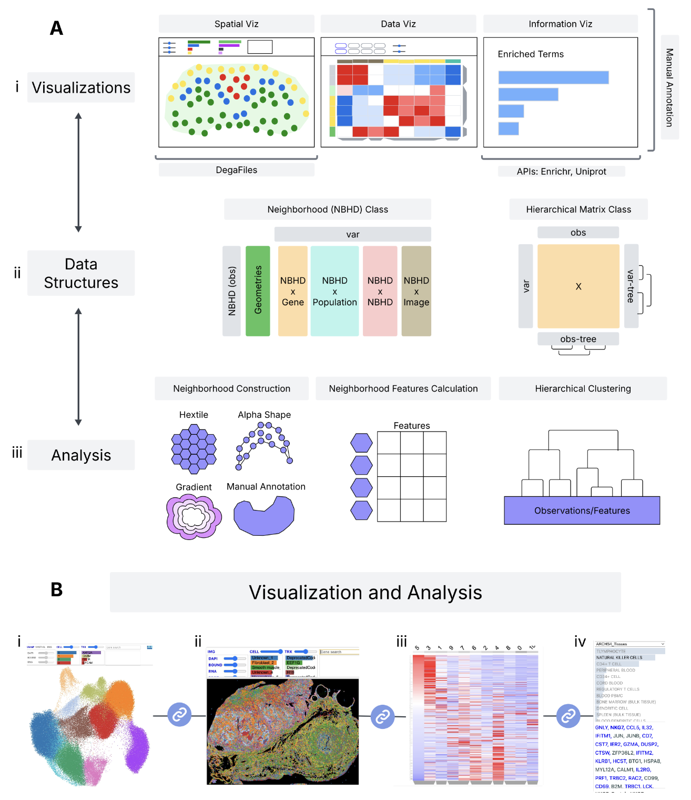

# Welcome to Celldega's Documentation

    

    Celldega Landscape visualization of a human skin cancer Xenium dataset obtained from <a href='https://www.10xgenomics.com/datasets' target='_blank'>10X Genomics</a>.

Celldega is a spatial analysis and visualization library that is being developed by the [Spatial Technology Platform](https://www.broadinstitute.org/spatial-technology-platform) at the [Broad Institute of MIT and Harvard](https://www.broadinstitute.org/spatial-technology-platform). This project enables researchers to easily visualize large ST datasets (e.g., datasets with >100M transcripts) alongside single-cell and spatial analysis notebook workflows (e.g., [sverse](https://scverse.org/) tools and novel spatial analysis approaches).

- [Getting Started](overview/getting_started.md)
- [Installation](overview/installation.md)
- [GitHub Repository](https://github.com/broadinstitute/celldega)

## What's New

Our new preprint, <a href="https://www.biorxiv.org/content/10.64898/2026.08.13.744672v2" target="_blank" rel="noopener noreferrer" style="color:var(--md-typeset-a-color); text-decoration:none;"><strong>Celldega: Integrated Toolkit for Visualization and Analysis of Spatial Data</strong></a>, is now available on bioRxiv.

## Intro Video

    <iframe src="https://www.youtube.com/embed/8C72vGHHyM0" title="Celldega Intro Video" style="position: absolute; top: 0; left: 0; width: 100%; height: 100%; border: 0;" allowfullscreen></iframe>

## About

Celldega is named after a bodega, a small shop with all the essentials that is part of the fabric of a neighborhood.

Celldega is open source and available on [GitHub](https://github.com/broadinstitute/celldega).
