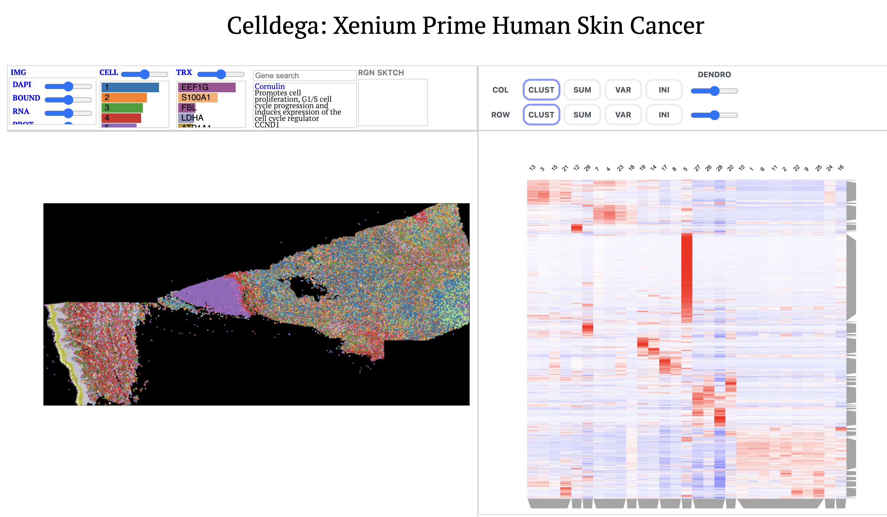

# Welcome to Celldega's Documentation

    

    Celldega Landscape visualization of a human skin cancer Xenium dataset obtained from <a href='https://www.10xgenomics.com/datasets' target='_blank'>10X Genomics</a>.

Celldega is a spatial analysis and visualization library that is being developed by the [Spatial Technology Platform](https://www.broadinstitute.org/spatial-technology-platform) at the [Broad Institute of MIT and Harvard](https://www.broadinstitute.org/spatial-technology-platform). This project enables researchers to easily visualize large ST datasets (e.g., datasets with >100M transcripts) alongside single-cell and spatial analysis notebook workflows (e.g., [sverse](https://scverse.org/) tools and novel spatial analysis approaches).

- [Getting Started](overview/getting_started.md)
- [Installation](overview/installation.md)
- [Usage](overview/usage.md)

## What's New
The project was recently presented at the Broad Retreat Data Visualization Breakout Session -

## About
Celldega is named after a bodega, a small shop with all the essentials that is part of the fabric of a neighborhood.